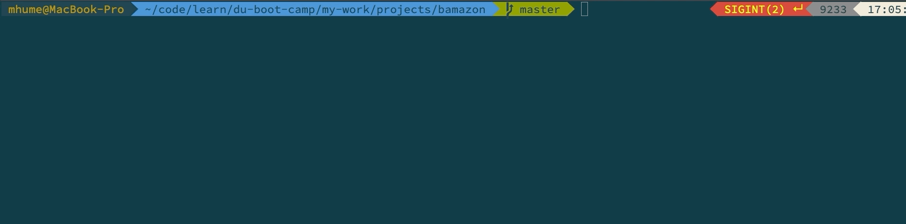
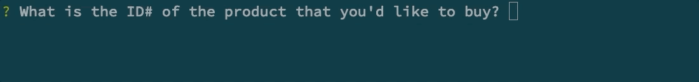
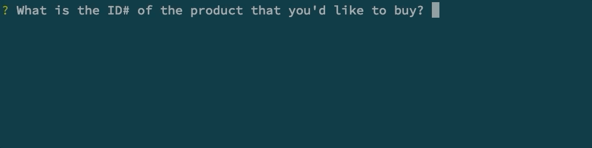

# Bamazon
CLI application that acts as an online storefront for purchasing products. 

## Getting Started
Choose how you would like to use the app.
[Customer](#customer)<br/>
[Manager](#manager)<br/>
[Supervisor](#supervisor)<br/>

### <a name="customer"></a> Customer
1. Type the following code into the command line:
```
node bamazonCustomer.js
```
*A table of all current products is displayed.*



2. Enter the ID# (item_id) of the product (product_name) that you'd like to purchase then press enter.
3. Enter the quantity that you'd like to purchase from the available stock (stock_quantity) and then press enter.

*If either entry is not a numerical value the app will notify you.*


*If ID# is not a found in the table the app will notify you.*


4. If not errors are found and there is sufficient stock, you will receive a receipt. 




5. You are then able to exit the app


### <a name="manager"></a> Manager
1. Type the following code into the command line:
```
node bamazonManager.js
```


### <a name="supervisor"></a> Supervisor
1. Type the following code into the command line:
```
node bamazonSupervisor.js
```


## Built With
* Node.js
* MySQL
* npm
    * [inquirer](https://www.npmjs.com/package/inquirer)
    * [mysql](https://www.npmjs.com/package/mysql)
    * [chalk](https://www.npmjs.com/package/chalk)
    * [dotenv](https://www.npmjs.com/package/dotenv)

## Author
Mike Hume
