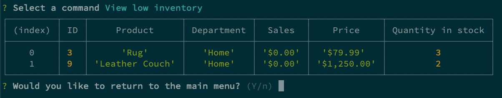
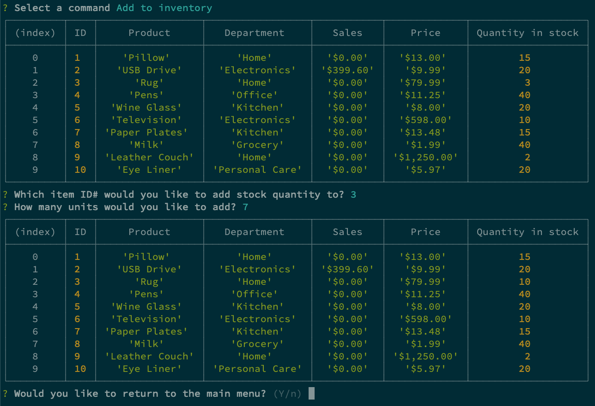

# Bamazon

## About
CLI application that acts as an online storefront for purchasing products. 

## Getting Started
Choose how you would like to use the app:
-   [Customer](#customer):
    -   Purchase items
-   [Manager](#manager):
    -   Maintain inventory / Add products
-   [Supervisor](#supervisor):
    -   Maintain departments / View profits

___
### <a name="customer"></a> Customer
Type the following code into the command line:
```
node bamazonCustomer.js
```
A list of commands will be provided.


#### Purchase a product


1.  Enter the ID# of the product which you would like to purchase.
2.  Enter the quantity.
3.  A receipt of purchase will be displayed and the grand total will be added to the 'Total Sales' column. 
4.  Errors:
-   If there is insufficient stock, you will be notified and prompted to re-enter your data.

-   If the value is not numerical, you will be notified and prompted to re-enter your data.


___
### <a name="manager"></a> Manager
Type the following code into the command line:
```
node bamazonManager.js
```
A list of commands will be provided.


#### View products for sale


#### View low inventory
*Products with a stock quantity below 5 will be shown.*


#### Add to inventory


1.  Enter the ID# of the product to which you would like to add stock.
2.  Enter the quantity.


#### Add new product


1.  Enter the product name.
2.  Enter the department name.
3.  Enter the product's price per unit.
4.  Enter the quantity of stock to add.

___
### <a name="supervisor"></a> Supervisor
Type the following code into the command line:
```
node bamazonSupervisor.js
```
A list of commands will be provided.


#### View total sales by department.
*Profit is calculated by the difference between overhead costs and total sales.*


#### Create new department


1.  Enter the department name.
2.  Enter the overhead costs.
3.  The 'Sales' & 'Total Profit' columns will remain 'null' until products are added.

___
## Built With
* Node.js
* MySQL
* npm
    * [inquirer](https://www.npmjs.com/package/inquirer)
    * [mysql](https://www.npmjs.com/package/mysql)
    * [chalk](https://www.npmjs.com/package/chalk)
    * [dotenv](https://www.npmjs.com/package/dotenv)

## Author
Mike Hume
